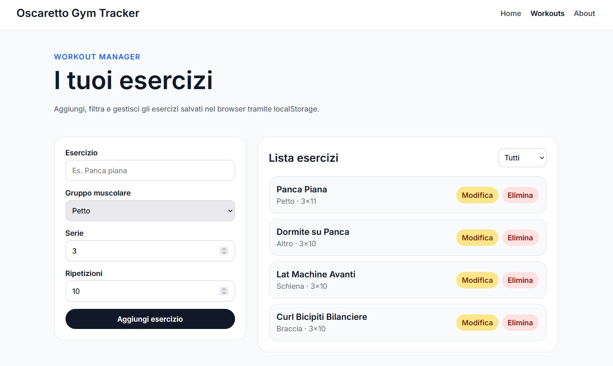

# Oscaretto Gym Tracker

Oscaretto Gym Tracker è una Single Page Application sviluppata in Angular come progetto portfolio.

L’app permette di gestire una semplice lista di esercizi da palestra direttamente nel browser, con funzionalità di aggiunta, modifica, eliminazione e filtro per gruppo muscolare.

## Funzionalità

- Aggiunta di nuovi esercizi
- Modifica degli esercizi esistenti
- Eliminazione degli esercizi
- Filtro per gruppo muscolare
- Persistenza dati tramite localStorage
- Layout responsive desktop/mobile
- Architettura frontend modulare e scalabile

## Stack Tecnologico

- Angular
- TypeScript
- Angular Router
- Standalone Components
- Reactive Forms
- Angular Signals
- Services
- localStorage
- SCSS

## Struttura del Progetto

```text
src/app/
├── components/
│   ├── navbar/
│   ├── workout-form/
│   └── workout-list/
├── models/
│   └── workout.model.ts
├── pages/
│   ├── about/
│   ├── home/
│   └── workouts/
└── services/
    └── workout.service.ts
```

## Architettura

Il progetto separa responsabilità e logica applicativa:

- `Workouts` gestisce orchestrazione, stato e filtro
- `WorkoutForm` gestisce reactive forms e validazione
- `WorkoutList` si occupa della visualizzazione della lista
- `WorkoutService` centralizza CRUD e persistenza dati
- `Workout` model definisce la struttura tipizzata dei dati

## Avvio in locale

Installazione dipendenze:

```bash
npm install
```

Avvio server di sviluppo:

```bash
ng serve
```

Applicazione disponibile su:

```text
http://localhost:4200
```

## Build Produzione

```bash
ng build
```

La build finale verrà generata nella cartella:

```text
dist/
```

## Obiettivo del progetto

Il progetto è stato realizzato per dimostrare competenze pratiche nello sviluppo frontend moderno con Angular, utilizzando componenti standalone, signals, reactive forms e una struttura modulare mantenibile.

## Screenshots


